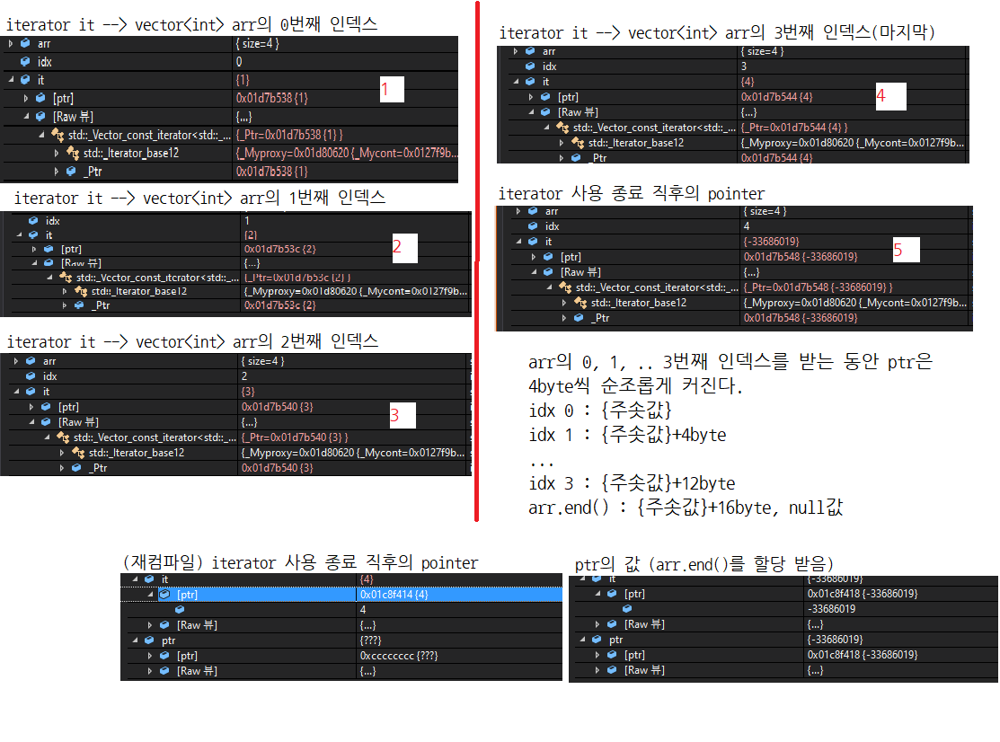
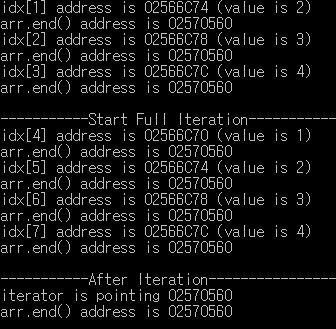
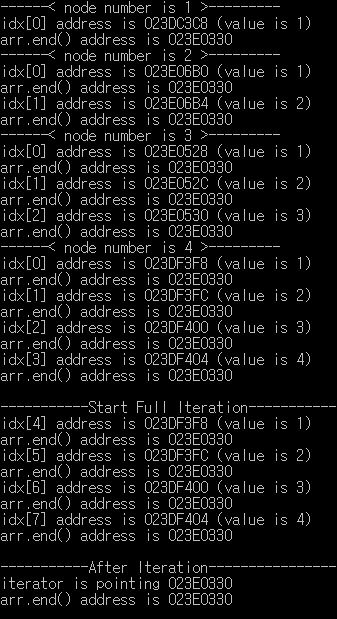

# 𝐂++ 𝐈𝐭𝐞𝐫𝐚𝐭𝐨𝐫 𝐄𝐱𝐩𝐞𝐫𝐢𝐦𝐞𝐧𝐭
환경 : Windows 10  
IDE : Visual Studio 2017  

C++ Iterator는 단순한 포인터로 동작하는 것인지, 나아가 vector 배열의 동작이 궁금하여 Visual Studio 2017에서 다음의 코드를 실행하고, 디버깅하며 변수의 주솟값 변화를 살펴보았습니다.  

```c++
#include <iostream>	
#include <vector>
#include <string>
#include <algorithm>
#include <stdio.h>

using namespace std;
int main()
{
	vector<int> arr = { 1,2,3,4 };
	vector<int>::iterator it;
	int idx = 0;
	printf("-----------Start Iteration----------------\n");
	for (it = arr.begin(); it < arr.end(); it++) {
		printf("idx[%d] address is %p (value is %d)\n", idx++, &(*it), *it);
		printf("arr.end() address is %p\n", arr.end());
	}
	
	printf("\n-----------After Iteration----------------\n");
	printf("iterator is pointing %p\n", it);
	printf("arr.end() address is %p\n", arr.end());

	return 0;
}

```

%p는 pointer를 담는 print format이어서, 해당 타입을 통해 it의 주솟값을 출력해주고자 하였습니다. 또한, 디버깅을 통해 arr을 순회하며 it의 주솟값 변화를 관찰했습니다.  



결과적으로, integer type 벡터 배열이기 때문에 인덱스가 1 증가할 때마다 4byte씩 주솟값이 커지는 것을 확인할 수 있었습니다! 또한, arr.end()에 도달하면 주솟값 내부의 값은 null이더라도 마지막 인덱스(idx 3)의 주솟값에 4바이트를 더해준 가장 끝 점을 가리키고 있는 것을 확인했습니다.  



그러나 %p를 활용해 주솟값을 찍어보았을 때에는 조금 다른 결과가 나왔습니다. idx 3일 때, 즉 벡터 배열의 마지막일 때의 주솟값은 886C7C로 10진수로 변환하면 8940668입니다. arr.end()의 주솟값은 890410으로 10진수로 8979472입니다. 그렇다면 arr.end()-{벡터 배열의 마지막 값} 즉 8,979,472 - 8,940,668 = 38,804 byte, integer를 9,701개 더 선언할 수 있는 만큼의 과도하게 많은 capacity가 왜 잡혀있는건지 도저히 이해가 가지 않습니다. (주솟값은 사진에 첨부하지 못했던 값을 활용했으나, 첨부된 캡처 역시 대략 16진수로 10,000 10진수로는 65,536 byte 만큼 더 잡혀있는 걸까요?  


C++ Vector의 capacity는 꽉 찰 경우마다 2배만큼 늘어나는 듯 했는데, 애초부터 매우 큰 메모리가 할당되어 있는 건지.. 조금 더 연구해봐야할 것 같습니다. 다음의 코드로, 벡터 배열에 숫자를 한개씩 넣어가며 메모리와 arr.end()를 살펴보았습니다.

```c++
#include <iostream>	
#include <vector>
#include <string>
#include <algorithm>
#include <stdio.h>

using namespace std;
int main()
{
	vector<int> arr = { 1 };
	vector<int>::iterator it;
	int idx = 0;

	printf("------< node number is 1 >---------\n");
	for (it = arr.begin(); it < arr.end(); it++) {
		printf("idx[%d] address is %p (value is %d)\n", idx++, &(*it), *it);
		printf("arr.end() address is %p\n", arr.end());
	}

	arr.push_back(2);
	idx = 0;

	printf("------< node number is 2 >---------\n");
	for (it = arr.begin(); it < arr.end(); it++) {
		printf("idx[%d] address is %p (value is %d)\n", idx++, &(*it), *it);
		printf("arr.end() address is %p\n", arr.end());
	}

	arr.push_back(3);
	idx = 0;

	printf("------< node number is 3 >---------\n");
	for (it = arr.begin(); it < arr.end(); it++) {
		printf("idx[%d] address is %p (value is %d)\n", idx++, &(*it), *it);
		printf("arr.end() address is %p\n", arr.end());
	}

	arr.push_back(4);
	idx = 0;

	printf("------< node number is 4 >---------\n");
	for (it = arr.begin(); it < arr.end(); it++) {
		printf("idx[%d] address is %p (value is %d)\n", idx++, &(*it), *it);
		printf("arr.end() address is %p\n", arr.end());
	}

	
	printf("\n-----------Start Full Iteration----------------\n");
	for (it = arr.begin(); it < arr.end(); it++) {
		printf("idx[%d] address is %p (value is %d)\n", idx++, &(*it), *it);
		printf("arr.end() address is %p\n", arr.end());
	}
	
	printf("\n-----------After Iteration----------------\n");
	printf("iterator is pointing %p\n", it);
	printf("arr.end() address is %p\n", arr.end());

	arr.clear();

	return 0;
}
```

그리고 그 결과입니다.  



그 어떤 경우에서도 arr.end()의 주솟값이 바뀌질 않고 있습니다 ㅠㅠ 제가 코드를 잘못 짜서 실험을 하고 있었거나, 애초에 이해부터 잘못하고 있었거나 둘 중 하나인 것 같네요. 시간이 많이 늦은 관계로 오늘은 여기까지만 하고, 다음에 또 시간이 여유로울 때에 시도해보도록 하겠습니다.  

